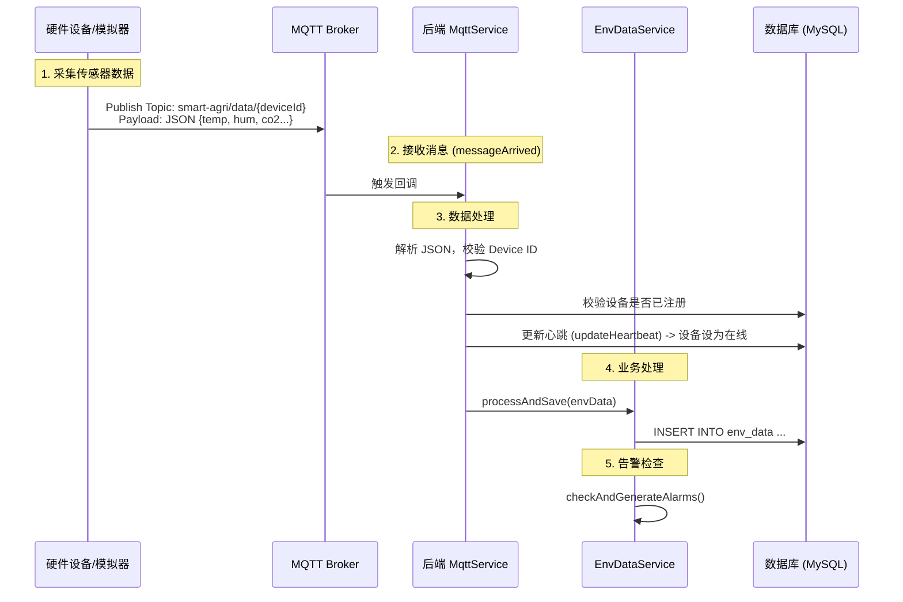

# 智慧农业平台 - 数据上传逻辑与全链路分析

本文档详细梳理了从硬件设备上传数据到后端处理、存储以及前端展示的完整流程，同时特别说明了告警系统的叠加聚合逻辑。

## 一、核心数据流 (Data Flow)

### 1. 设备 -> 服务器 (Uplink)

数据从硬件设备产生，经过 MQTT 协议传输到后端服务并存储。

**关键技术点：**

- **Topic 规范**: `smart-agri/data/{deviceId}`
- **心跳机制**: 任何 MQTT 消息（数据或ACK）都会触发 `updateHeartbeat`，保证设备在线状态实时更新。
- **异步解耦**: 告警检查逻辑内嵌在数据保存流程中，确保数据落库即检查。

### 2. 服务器 -> 前端 (Downlink / Query)

前端通过 REST API 获取实时数据。

- **设备列表**: `/api/device/page` (包含在线状态)
- **最新数据**: `/api/env-data/latest/{deviceId}` (用于实时监控卡片)
- **历史趋势**: `/api/env-data/history` (用于 ECharts 图表)

---

## 二、告警系统逻辑 (Alarm System)

针对“设备持续故障导致告警刷屏”的问题，系统实施了**告警聚合 (Alarm Aggregation)** 策略。

### 告警触发流程

1.  **规则匹配**：`checkAndGenerateAlarms` 方法获取当前设备适用的所有启用规则（如：温度 > 30℃）。
2.  **阈值检查**：比对当前上传的数值与规则阈值。
3.  **聚合处理** (`createAlarm` 方法)：
    - 系统首先查询数据库：是否存在该设备、该规则下的**未处理 (status=0)** 告警。
    - **情况 A：存在旧告警**（即设备之前已经报警且未处理）
      - **不创建新记录**。
      - **更新**该条告警记录：
        - `value` -> 更新为当前最新值
        - `triggered_at` -> 更新为当前最新时间
        - `message` -> 更新为最新描述
    - **情况 B：不存在旧告警**（即新故障）
      - **创建**一条新的告警记录。
      - 状态设为 `0` (未处理)。

### 效果

- **前端展示**：在告警中心，对于持续的故障，用户永远只会看到**一条**代表最新状态的告警条目，而不是成百上千条重复记录。
- **历史追溯**：虽然告警记录被聚合了，但原始的环境数据（`env_data` 表）依然完整记录了每一次上报的数据，可通过趋势图查看故障期间的数值波动。

---

## 三、数据库设计 (Schema)

### 1. env_data (环境数据表)

| 字段        | 类型     | 说明     |
| ----------- | -------- | -------- |
| id          | Long     | 主键     |
| device_id   | Varchar  | 设备ID   |
| temperature | Decimal  | 温度     |
| humidity    | Decimal  | 湿度     |
| ...         | ...      | 其他指标 |
| ts          | DateTime | 采集时间 |

### 2. alarm (告警表)

| 字段         | 类型     | 说明                            |
| ------------ | -------- | ------------------------------- |
| id           | Long     | 主键                            |
| device_id    | Varchar  | 设备ID                          |
| rule_id      | Long     | 关联规则ID                      |
| metric       | Varchar  | 告警指标 (如 temperature)       |
| value        | Decimal  | **当前最新异常值** (聚合更新)   |
| triggered_at | DateTime | **当前最新触发时间** (聚合更新) |
| status       | Int      | 0=未处理, 1=已处理              |
